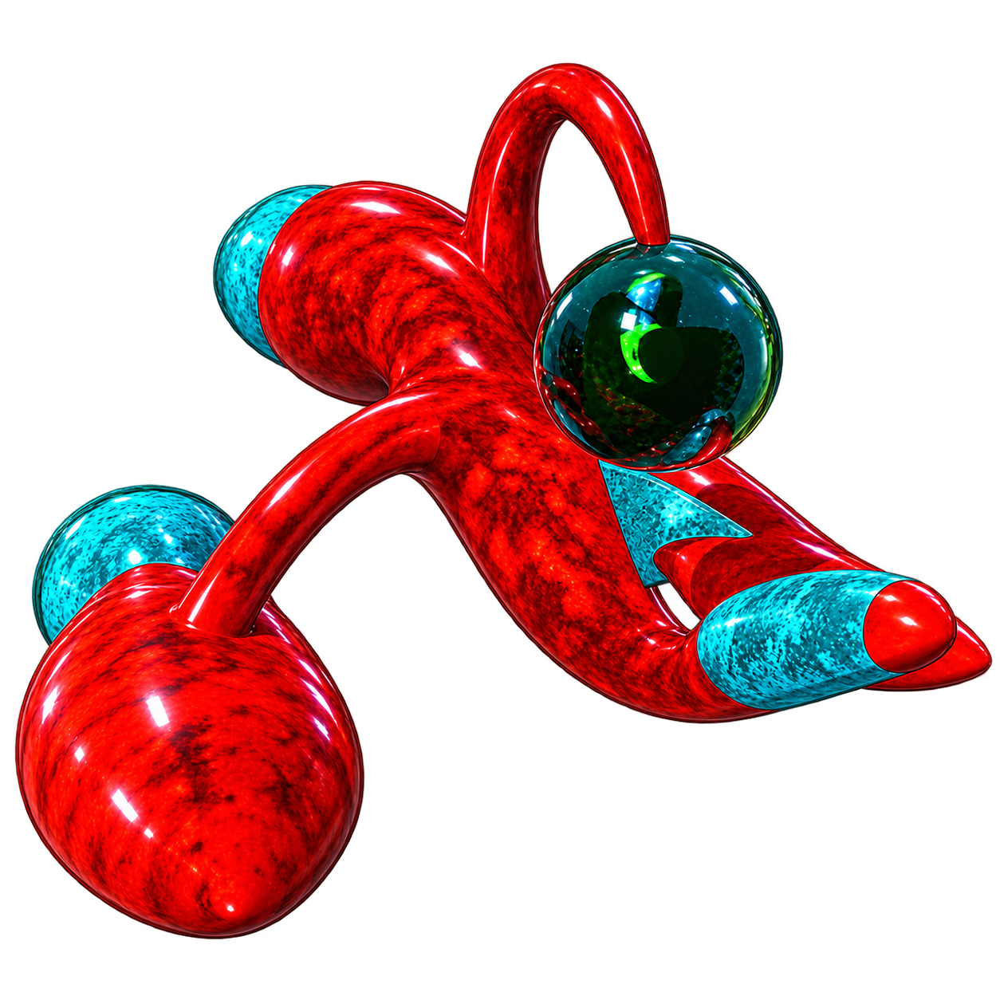

<p align="center">
  
</p>

# The Zone Remastered — Engineering Milestone 1.10

Native Apple remaster built from the reverse-engineered *TheZone* 1.5.1 game logic and assets.

## Current verification status

- **The Zone macOS** — native macOS application, verified building and running on macOS 15 Sequoia. Keyboard is canonical; controllers exposed by Apple's `GameController.framework` are supported as an alternate input path.
- **The Zone iPadOS** — separate native iPadOS application target. Apple-supported game controllers are first-class; touch controls remain available when no controller is connected.
- **ZoneCore** — deterministic portable C engine library, with no AppKit/UIKit/Metal dependencies.

## Milestone 1.10 — Shared Object Slots & +138 List Fidelity

Milestone 1.10 promotes the exact recovered 80-record allocator and `+138` object-chain ordering. The persistent player/head is Classic slot 0; mode 0 allocates low-to-high and inserts immediately after the head, while mode 1 allocates high-to-low and appends at the list tail. Player shots and Headquarters fire use the low mode; fixed/world objects and moving-enemy fire use the high mode. Ship/world destruction now transforms the same Classic record into `EXPL`, preserving slot identity and list position until finalization, and known first-match Bee/Mother scans follow Classic list order instead of typed-array order.

Reverse engineering in this phase also identifies object byte `+129` as coarse spatial-cell registration. Full non-projectile `+128/+129` behavior remains deferred until the original camera/world-to-screen transform is restored rather than guessed.

Detailed notes: [`Docs/MILESTONE-1.10.md`](Docs/MILESTONE-1.10.md) and [`Docs/RE-object-list-slot-order.md`](Docs/RE-object-list-slot-order.md).

## Milestone 1.9 — Recovered Projectile Spatial Retirement

Milestone 1.9 removes the provisional player-shot 90-step and hostile-fire 120-step lifetimes. PPC `shot` (`0x11D44`) and `fire` (`0x11D6C`) are gated by object `+128` and contain no lifetime countdown; the spatial pass clears `+128` when a projectile sprite leaves the live screen rectangle, after which `fire` is finalized and `shot` is unlinked/freed. ZoneCore now keeps projectile coordinates unwrapped, translates the Classic top-left spatial bounds into center coordinates using the recovered sprite side, and retires projectiles on the existing 60-Hz Classic boundary while continuing real 720-Hz position integration. Hostile source-shot accounting is released on off-region removal.

Detailed notes: [`Docs/MILESTONE-1.9.md`](Docs/MILESTONE-1.9.md) and [`Docs/RE-projectile-spatial.md`](Docs/RE-projectile-spatial.md).

## Milestone 1.8.1 — Front-End Polish & Navigation

Milestone 1.8.1 polishes the accepted native front end with explicit keyboard/controller selection semantics, controller-operable Preferences and iPad Pause flow, safer held-button edge handling, improved selected-state presentation, transitions, and iPad safe-area layout. It remains a product-layer checkpoint and leaves ZoneCore/gameplay timing unchanged.

## Milestone 1.8 — Native Front-End & Title Screen

Milestone 1.8 turns the Apple engineering harness into a product flow. Native macOS and iPadOS now boot into a shared SwiftUI title screen with an animated recovered 48-frame ship emblem, New Game, Controls, persistent presentation Preferences, Credits, and macOS Quit. New Game constructs a fresh gameplay host; both platforms can return from Pause to the title screen; and `ZONE_BOOT_DIRECT=1` preserves direct engineering boot. ZoneCore, the 720-Hz motion path, Classic decision/collision cadence, Metal renderer, and AVAudioEngine backend are unchanged.

Detailed notes: [`Docs/MILESTONE-1.8.md`](Docs/MILESTONE-1.8.md) and [`Docs/NATIVE-FRONT-END.md`](Docs/NATIVE-FRONT-END.md).

## Milestone 1.7 — Death, Explosion & Wave Timing Fidelity

Milestone 1.7 removes provisional frame-count timing from death and fixed-wave completion. Ship respawn is driven by completion of the recovered 20-frame ship explosion; Mother/HQ objective count falls at transformed-explosion finalization; and the next fixed wave begins through the recovered objective-zero relationship instead of an invented 90-tick delay.

## Milestone 1.6 — Shared 80-Slot Capacity & Base Impact Parity

Milestone 1.6 enforces the recovered shared 80-object admission budget across ship, world bodies, projectiles and explosions, and restores additional Mother/HQ ship-impact consequences including Mother motion-state reset and impact feedback while keeping typed portable storage internally.

## Milestone 1.5 — Native High-Rate Dynamics Phase 1

Milestone 1.5 moves real player, world-object, and projectile position integration onto the **720-Hz master grid**. Recovered decisions remain on the **60-Hz Classic cadence**: input/thrust decisions, AI, RNG/fire gates, timers, exact-pixel collision, projectile lifetime, wave lifecycle, and explosion aging are not multiplied by display refresh. Twelve master substeps land on the same Classic boundary while 120/144/165/240-Hz displays can observe genuinely new ZoneCore positions between those boundaries.

The old `zone_game_step()` remains unchanged as the deterministic Classic reference. Native high-rate motion is the default host path; `Tools/run-macos-refresh.command ... classic` selects the accepted 1.4 path for direct A/B testing. No interpolation or extrapolation is introduced.

Detailed notes: [`Docs/MILESTONE-1.5.md`](Docs/MILESTONE-1.5.md) and [`Docs/RE-high-rate-dynamics.md`](Docs/RE-high-rate-dynamics.md).

## Milestone 1.4 — Display-Independent Timebase & Native-Refresh Presentation

Milestone 1.4 breaks the old one-render-callback/one-game-step coupling. A monotonic **720-Hz master scheduling grid** now drives the host, with one authoritative Classic step every **12 master ticks = 60 Hz**, while Metal presentation requests the active screen's native maximum refresh. 120/144/165/240-Hz presentation therefore no longer changes game speed.

This is deliberately the foundation, not a fake-smoothing layer: there is no interpolation or extrapolation, and ZoneCore gameplay remains unchanged. The package also adds a headless Wave-18 benchmark for 240/480/720/960/1440-Hz candidate dynamics rates. Continuous motion can be promoted to the high-rate grid only after benchmark and regression evidence justify it.

Detailed notes: [`Docs/MILESTONE-1.4.md`](Docs/MILESTONE-1.4.md) and [`Docs/RE-high-refresh-timebase.md`](Docs/RE-high-refresh-timebase.md).

## Milestone 1.3 — Bee & Seeker State Completion

Milestone 1.3 returns to Classic gameplay reconstruction on the accepted 1.2 runtime. Bee PPC `0x154A8` and Seeker PPC `0x15944` now honor their recovered `+66/+92` timed hit-state gates: while elapsed Classic TickCount is below **60**, they retain existing motion and skip retarget/facing/fire; at elapsed 60 the state clears and normal behavior resumes. The Seeker player/body collision path at `0x1A0B4..0x1A0C8` backdates `+92` by **30**, leaving half of the full interval after contact.

The earlier roadmap description of a Bee "return" state is corrected: the Bee handler does not read its donor link and contains no recovered return-to-parent navigation. Professional Wave 2 now supplies a real fixed-wave integration regression proving that a nonlethal hit on one Mother can request a Bee from the other Mother, while Wave 1 still correctly cannot self-donate.

Detailed notes: [`Docs/MILESTONE-1.3.md`](Docs/MILESTONE-1.3.md) and [`Docs/RE-bee-seeker.md`](Docs/RE-bee-seeker.md).

## Milestone 1.2 — Host Stall Attribution

Milestone 1.2 keeps the accepted 1.1 gameplay/rendering behavior unchanged and splits remaining slow `host.step()` frames into input, ZoneCore, audio-drain, audio-trigger, and HUD stages. Audio triggers are independently split into player rewind and `AVAudioPlayer.play()` timing. The diagnostic runner now prints an automatic compact summary after each perf session.

Detailed notes: [`Docs/MILESTONE-1.2.md`](Docs/MILESTONE-1.2.md).

## Milestone 1.1 — Real-Time Hot-Path Repair

Milestone 1.1 removed synchronous sprite texture construction and per-event audio-player construction from active gameplay while preserving the Milestone 1.0 ZoneCore/60-Hz host contract. Extended play testing successfully cleared Zone 1 with all 651 sprite textures preloaded and no observed texture-cache misses or 16-voice-bank exhaustion.

Detailed notes: [`Docs/MILESTONE-1.1.md`](Docs/MILESTONE-1.1.md).

## Milestone 1.0 — Rotor Orbit, Attack & Return AI

Milestone 1.0 promotes the linked Rotor guard from a fixed-wave population object into its recovered Classic behavior state machine.

- promotes the Rotor handler at PPC `0x15BC8..0x16124` with live byte `+131` states **0 = orbit**, **1 = attack**, and **2 = return**;
- restores the recovered **40-unit** guard orbit around the linked Mother Base or Headquarters and the **4-degree** orbit-heading increment;
- wakes an orbiting Rotor when the player enters the recovered **100-unit** proximity radius;
- attack state pursues at recovered speed **10** and switches to return when the Rotor crosses the recovered **160-unit** parent leash in the 640-unit Classic zone;
- return state flies toward the parent at recovered speed **20** and drops back into orbit inside the **40-unit** guard radius;
- preserves the original bidirectional parent relationship: Rotor link1 points to its parent and the parent link2 points back to its Rotor;
- restores collision wake semantics: a valid player-shot hit on the Rotor wakes attack state, and a nonlethal Mother Base hit wakes its linked Rotor;
- adds Rotor hostile fire using the recovered strict signed-Random window `10000 < Random() < 15000` and the shared **3 active hostile shots** cap;
- fixes linked-child cleanup so destroying a Rotor clears the parent Rotor link without incorrectly decrementing the parent's launched-defender count;
- adds deterministic regression coverage for constants, link/wake behavior, orbit → attack → return transitions, fire eligibility, and cleanup.

The original shared 80-object allocator, exact Classic Mac `Random()` sequence, and remaining Bee/Seeker/collision edge states are still intentionally separate parity work. Milestone 1.0 does not replace unknown rules with remaster guesses.

Detailed notes: [`Docs/MILESTONE-1.0.md`](Docs/MILESTONE-1.0.md).

## Milestone 0.9 — Mother Base Motion & Headquarters Fire

Milestone 0.9 advances the Classic-fidelity roadmap directly from the committed 0.8 base-damage/HQ-defense checkpoint.

- promotes the recovered fixed-wave `mobile_moth_quota` into live Mother Base object state `+84`;
- promotes the Mother Base movement selector at PPC `0x14C70`: state **0** preserves existing motion, state **1** uses the recovered accelerative chase rule, and state **2** uses direct pursuit;
- state 2 uses the recovered **200-unit** near/far threshold: runtime maximum speed inside the radius and recovered cruise speed **10** outside;
- promotes the destruction consequence at PPC `0x19C38..0x19C98`: after a player-shot kill, the first eligible mobile Mother receives state **1 or 2** in `+86`;
- implements the original range-helper behavior for that selector: `RandomRange(1,3)` has an upper-exclusive bound, therefore state 3 is unreachable at this callsite;
- keeps Mother Base/HQ sprite frames stable while motion state changes;
- promotes the independent Headquarters/base behavior path at PPC `0x14B18`: an aimed hostile `fire` projectile every **15 behavior ticks** when a projectile slot is available;
- keeps HQ firing separate from the recovered **3 active shots/shooter** tail used by Bloody, Bee, Raider, and Seeker;
- adds deterministic regression coverage for wave quota assignment, kill activation, all three Mother motion states, and HQ firing cadence.

The portable core still uses its split world/projectile pools rather than the original shared 80-object allocator. That allocator-parity detail, exact linked-list traversal ordering, classic Mac `Random()` sequence compatibility, and remaining Mother/HQ collision/state edge behavior stay explicitly pending rather than being guessed.

Detailed notes: [`Docs/MILESTONE-0.9.md`](Docs/MILESTONE-0.9.md).

## Milestone 0.8 — Base Damage Feedback & Headquarters Defense

Milestone 0.8 begins with the known 0.7 play-test regression before adding further roadmap work.

- verifies that Professional Mother Base damage remains cumulative through the full **40-hit** threshold even after its linked-defender cap is saturated;
- restores the original nonlethal Mother Base/HQ hit-feedback semantic from PPC `0x19C9C`: a one-draw damage flag plus hit sound request on every valid nonlethal hit;
- exposes that original damage flag to the Metal renderer as a short white impact flash, so valid hits remain visibly distinguishable from misses after defender spawning has capped out;
- promotes the separate Headquarters hit-reaction routine at PPC `0x16390`;
- Headquarters now launch linked defenders from their four corner positions with the recovered active cap of **4 Professional / 2 Beginner**;
- keeps Mother Base Bee-request behavior separate: Headquarters launch defenders but do not take the Mother Base's Bee-request branch;
- adds deterministic regression coverage for a full 40-hit Mother Base destruction chain and Headquarters defender replenishment.

The exact classic palette operation used by the original `+133` draw flag and the exact original sound-resource mapping for sound-dispatch index 8 are still pending. The remaster preserves the recovered event semantics now without pretending those two presentation details are fully lifted.

Detailed notes: [`Docs/MILESTONE-0.8.md`](Docs/MILESTONE-0.8.md).

## Milestone 0.7 — Hostile Combat, Fixed-Wave Lifecycle & Keyboard Remapping

Milestone 0.7 follows the existing Classic-fidelity roadmap while adding one focused macOS product feature requested during play-testing:

- implements the recovered hostile `fire` projectile base speed of **11.25**;
- promotes the recovered strict signed-Random firing windows for Bloody, Bee, Raider and Seeker;
- enforces the recovered **3 active hostile shots per shooter** limit;
- adds exact-pixel hostile-shot collision with the player and source-counter cleanup;
- activates Bee pursuit and Seeker's recovered **200-unit** near/far speed switch;
- connects direct fixed-wave population data through waves **1–18** and adds the combat-objective wave-clear lifecycle;
- advances a completed Wave 1 into the recovered Wave-2 population after a short isolated transition delay;
- adds a native macOS **Keyboard Controls** panel to the pause menu;
- supports click-to-rebind, automatic conflict swapping, persistent `UserDefaults` storage, and **Reset Defaults** back to the Classic keyboard layout.

Keyboard remapping is deliberately outside ZoneCore. The engine continues to receive the same semantic actions (`turn`, `thrust`, `fire`, etc.), so changing a Mac key cannot alter Classic gameplay behavior or the iPad/controller architecture.

Detailed notes: [`Docs/MILESTONE-0.7.md`](Docs/MILESTONE-0.7.md).

Project status and upcoming phases are tracked in [`Docs/ROADMAP.md`](Docs/ROADMAP.md).

## Milestone 0.6 — Enemy Life & Real Wave 1

Milestone 0.6 established the first live enemy ecosystem: recovered Mother Base defender launch behavior, linked Empire Fighters, Bee donor/requester relationships, and the pause/Mother-Base stability fixes finalized in 0.6.2.

## Milestone 0.5 — Destruction, Pickups & Progression

Milestone 0.5 established the recovered progression/destruction chain: initial max speed 25, VELO/AMMO/OSCI effects, asteroid payloads, Big Rock fragmentation structure, and the first ship death/respawn lifecycle. See [`Docs/MILESTONE-0.5.md`](Docs/MILESTONE-0.5.md).

## Milestone 0.3 — Real Zone, phase 1

- Corrects the Classic Macintosh coordinate interpretation that caused projectile motion to be rotated relative to the visible ship. The original code stores the recovered vector in **vertical/horizontal** order; portable screen coordinates are therefore `X = cos(angle)`, `Y = -sin(angle)`.
- Decodes and embeds the shipping **Math resource #2** muzzle table: 48 exact `(x,y)` offsets, one per visible ship frame. Projectile spawn location now comes from the original table rather than an estimated nose distance.
- Keeps projectile velocity tied to the original integer heading while the muzzle location is tied to the exact visible 48-frame orientation, matching PPC `0x12224`.
- Corrects portable thrust mapping through the same classic-Mac vertical/horizontal boundary.
- Replaces the one-asteroid sandbox with the recovered **professional wave-1 population**: 3 asteroids plus 1 Mother Base.
- Promotes recovered damage thresholds and kill scores into the live core for those objects.
- Uses the correct size-selected explosion banks: 32px objects use the 11-frame `600` bank and 48px objects use the 11-frame `20000` bank.
- Adds `BASES` and `ENEMIES` to the live HUD state.
- Adds regression tests for all 48 muzzle orientations and exact wave-1 population.

The Mother Base's full movement/Bee-spawning state machine remains the next gameplay lift; milestone 0.3 intentionally does not invent those rules.

## Playable foundation

- Original 640×480 logical viewport, Retina/widescreen letterboxing in Metal.
- Original 48-frame player `Spri` art.
- Original asteroid, shot and 20-frame explosion art.
- Recovered 7.5° sprite orientation system.
- Recovered continuous-motion X≈0.325/Y=0.25 scaling.
- Recovered 15-unit projectile vector basis.
- Exact nonzero-pixel collision using original indexed sprite bytes in ZoneCore.
- Ship rotation/thrust, firing, asteroid destruction, explosion, score and shield collision.
- Original 36 Sound Manager samples converted to WAV and bundled. Initial event mappings remain provisional pending completion of sound-dispatch lifting.

## Build

Open `TheZoneRemastered.xcodeproj` in Xcode.

For the native Mac application select:

```text
The Zone macOS > My Mac
```

Then press **⌘B** to build or **⌘R** to run.

Native command-line checks/builds:

```bash
./Tools/verify-native-targets.command
./Tools/test-zonecore.sh
./Tools/build-macos.command
./Tools/build-ipados-simulator.command
./Tools/build-ipados-device.command
```

## Canonical macOS controls

The Classic defaults remain:

- Left/Right arrows: rotate
- Space: thrust
- Option: fire
- Up/Down arrows: equipment selection
- Command: select/use
- Escape: pause
- Keypad decimal: classic save action hook

While paused on macOS, choose **Keyboard Controls**, click any binding, and press its replacement key. Bindings persist between launches. **Reset Defaults** restores the Classic layout. Option and Command are treated as modifier families, so either physical side works when those actions retain those bindings.

## Controller policy

There is intentionally **no brand/device whitelist**. Controller support comes from `GameController.framework`; any controller recognized and normalized by Apple is accepted. Classic gameplay turns analog inputs into the original digital actions.

## Artwork and macOS app icon

The selected source artwork lives at:

```text
Docs/images/TheZoneRemastered-Ship.png
```

The Mac asset catalog lives at:

```text
macOS/Assets.xcassets/AppIcon.appiconset
```

To regenerate the icon sizes on macOS from the source artwork:

```bash
./Tools/generate-macos-app-icon.command
```

The source art remains untouched; generated icon PNGs are derived assets.

## Accuracy status

Milestone 1.0 is the current recovered-gameplay build. It is not yet a claim of 100% behavior parity. Exact sprite collision, object/save layouts, damage tables, fixed wave presets, several AI routines and core motion semantics have been recovered. Remaining AI/collision/wave/projectile/equipment state machines are being lifted into `ZoneCore/Recovered` and will replace temporary milestone logic subsystem-by-subsystem.

## Asset completeness

The project carries all **651** recovered `Spri` images and all **36** recovered `snd ` resources. ZoneCore also contains the indexed pixel payload for all 651 sprites, generated from the original resource fork, so every future object class can use the exact original nonzero-pixel collision masks.

Regenerate the collision database after a fresh resource extraction with:

```bash
./Tools/generate-zone-sprite-data.py /path/to/TheZone_Sprites ZoneCore/src/zone_sprite_data.c
```

## Native target policy

This project intentionally ships **two distinct native Apple application targets**:

- **The Zone macOS** — macOS SDK; AppKit/SwiftUI/Metal; deployment target macOS 15 Sequoia; keyboard is canonical, with GameController support alongside it.
- **The Zone iPadOS** — iPadOS/iOS SDK for **iPad only**; UIKit/SwiftUI/Metal; GameController plus touch/keyboard input.

The iPad target explicitly disables both **Mac Catalyst** and **Mac (Designed for iPad)**. It is not the Mac version of the game. The shared C `ZoneCore` is compiled for the active native SDK, so no macOS static-library binary is linked into the iPad build.

Run `./Tools/verify-native-targets.command` on a Mac with Xcode to assert these settings.

## Sequoia policy

The installed Xcode SDK and the minimum OS are intentionally separate concepts. A current Xcode may report `SDKROOT = macosx26.x`; the native Mac app remains explicitly pinned to `MACOSX_DEPLOYMENT_TARGET = 15.0` and is developed to remain compatible with macOS 15 Sequoia rather than requiring macOS 26 APIs.

## Milestone 0.4 — Collision Physics, Phase 1

Milestone 0.4 replaces the temporary per-frame shield-loss collision behavior with recovered PowerPC collision semantics.

Implemented in the live ZoneCore:

- exact sprite-pixel contact remains the collision oracle;
- ordinary player/object impacts exchange momentum and calculate shield damage using the recovered `0x19DFC` type divisors/caps;
- Mother Base/HQ impact damage uses the recovered `0.75 × ship speed` rule from `0x174E8`, capped at 30;
- striking a stationary Mother Base transfers the ship's velocity to the base, and the base now moves with that transferred momentum;
- sustained overlap is contact-latched so one collision does not drain shields or swap velocities on every rendered frame;
- Wave-1 world bodies exchange velocities on first exact-pixel contact using the semantics of the recovered `0x181A4` paths.

Detailed reverse-engineering notes and formulas are in [`Docs/MILESTONE-0.4.md`](Docs/MILESTONE-0.4.md).
